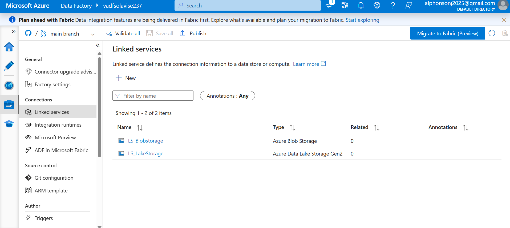
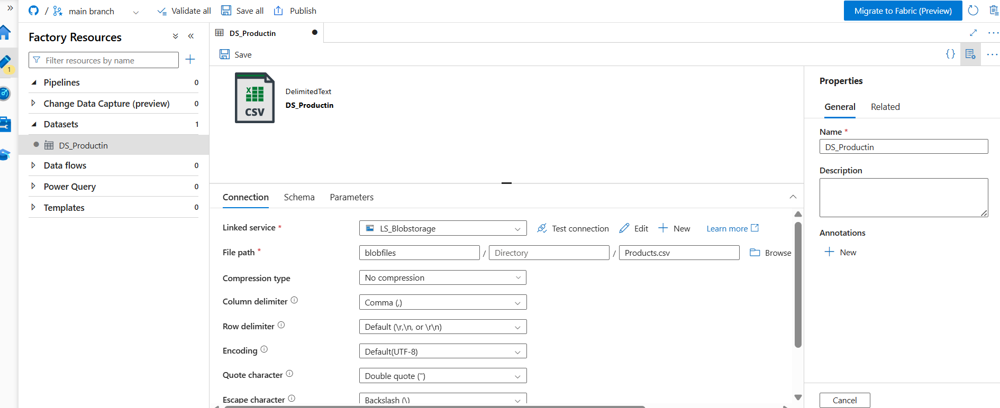
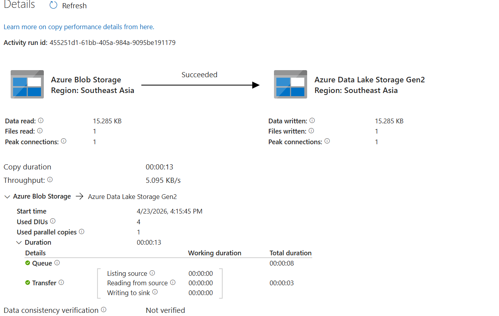

# Azure Data Factory Project

## Project: Sales Data Pipeline

This project demonstrates:
- Data ingestion using Azure Data Factory
- Copying data from source to destination
- Pipeline orchestration

## Tools Used:
- Azure Data Factory
- Azure Blob Storage
- GitHub

## Description:
This project shows how data is moved from a source system into a destination using ADF pipelines, with GitHub integration for version control.

## Author:
Alphonso
### 📸 Linked Services Screenshot

Below shows the configured Linked Services in Azure Data Factory, including Blob Storage and Data Lake Storage Gen2 used for data ingestion.

📊 Azure Data Factory – Dataset Creation Project

This project demonstrates how datasets were created and configured in Azure Data Factory using Azure Blob Storage.

---

🔹 Linked Service Setup

Connection established between Azure Data Factory and Blob Storage.

"Linked Service" (images/linked_service.png)

---

🔹 Dataset Naming Convention

A structured naming convention was applied for clarity and maintainability.

"Dataset Naming" (images/dataset_naming.png)

---

🔹 Blob Dataset Creation

Dataset created for product data stored in Blob Storage.

"Blob Dataset" (images/blob_dataset_creation.png)

---

🔹 File Path Configuration

Dataset configured with container, directory, and file path.

"File Path" (images/dataset_file_path.png)

---

🚀 Summary

- Created Linked Services
- Built datasets for Blob Storage
- Applied professional naming conventions
- Configured file paths correctly

Next step: Build pipeline to move data from Blob to Data Lake.

Batch & Sequential Processing Design
This pipeline was enhanced to support dynamic batch ingestion using parameterization and controlled execution.
⚙️ Key Features
Batch Processing: Multiple tables processed in one pipeline
Sequential Execution: Controlled using ForEach (Batch count = 1)
Dynamic Table Handling: Table names passed as parameters

[
  {"table": "SalesLT.Customer", "folder": "customer"},
  {"table": "SalesLT.Product", "folder": "product"},
  {"table": "SalesLT.SalesOrderHeader", "folder": "salesorder"}
]

ForEach Loop
   ↓
Dynamic Copy Activity
   ↓
SQL → Data Lake (per table)
